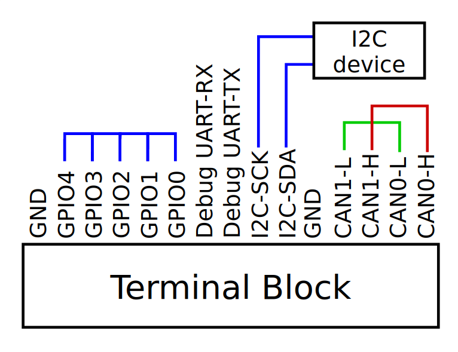
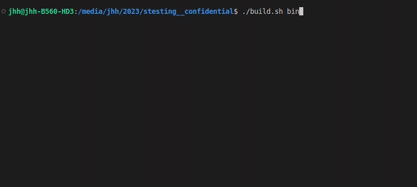
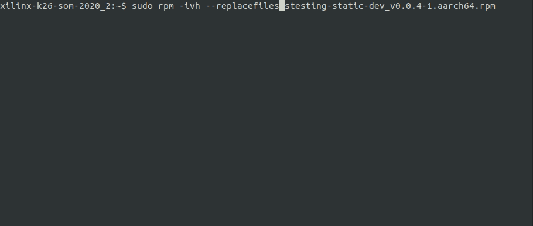
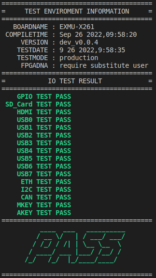
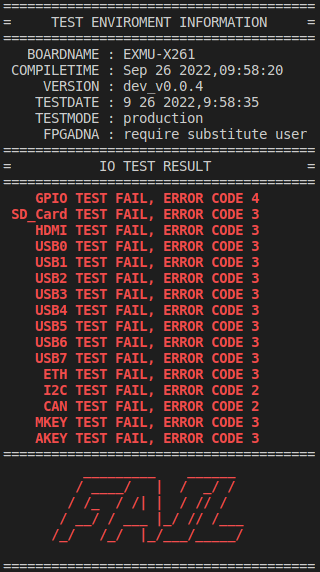
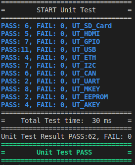

<!--
 Copyright (c) 2022 Innodisk crop.
 
 This software is released under the MIT License.
 https://opensource.org/licenses/MIT
-->
[](https://github.com/InnoIPA/stesting-sc/actions)
[](https://github.com/aiotads/stesting__confidential/actions)


- [Overview](#overview)
- [Requirement](#requirement)
  - [HW requirement](#hw-requirement)
  - [FW requirement](#fw-requirement)
  - [SW requirement](#sw-requirement)
- [Usage](#usage)
- [How to install](#how-to-install)
  - [Build from source code](#build-from-source-code)
  - [Install by rpm](#install-by-rpm)
- [How to run](#how-to-run)
- [How to test](#how-to-test)
- [API](#api)
- [License](#license)

# Overview
Stesting provide the board io self testing, some of the io test required jigs.

# Requirement
## HW requirement
- EXMU-X261
- Debug board for EXMU-X261
- Jigs for EXMU-X261  
  There needs a 120 ohm resistor connect between CAN-L and CAN-H, user can turn on one of switch from `sw7` on EXMU-X261 or add resistor on the jig to make it work.
  
## FW requirement
Must use `xmutil` of `xlnx-config.xmutil` to load the firmware of progarmmable logic before running `stesting`, because some of the IO (PCIE, GPIO, I2C, CAN) are pinout through PL. 
## SW requirement
Utility | Suggest Version
---|---
dd | 8.30
fio | 3.16
lspci | 3.6.4
ifconfig | 2.10
i2c-tools | 4.1-2build2 arm64
can-utils | 2018.02.0-1ubuntu1 arm64

# Usage
```bash
stesting [-h] [-u] [-d MODES] [-c CONFIG] [-l LOG]

optional arguments:
  -h, show this help message and exit
  -v, show version of stesting
  -u, run unit-test (need dummy config file)
  -g, run unit-test without config file
  -c, config file path, default is /opt/innodisk/stesting/cfg.json
  -l, log file path, default is /opt/innodisk/stesting/log.json
  -d, debug mode, add MODES for pipline test if in need 
available MODES
  [0] GPIO      [1] ETH     [2] USB     [3] HDMI
  [4] SD_Card   [5] I2C     [6] CAN     [7] UART
  [8] MKEY      [9] EEPROM  [A] AKEY    [q] QUIT 
```

# How to install
## Build from source code
Examples of supported combinations of compile are outlined below.
The cross compiler could download from [here](https://releases.linaro.org/components/toolchain/binaries/latest-7/aarch64-linux-gnu/gcc-linaro-7.5.0-2019.12-x86_64_aarch64-linux-gnu.tar.xz).  
Default build script `build.sh` is using `cmake`, user can also use the `meson` & `ninja` by reference `meson_example.sh`.
- Download and setup the cross compiler with cmd below.  
    `./build.sh downloadcc`
- Compile binary file by using host compiler with static library.  
    `./build.sh bin host static`
- Compile binary file by using host compiler with shared library.  
    `./build.sh bin host shared`
- Compile binary file by using cross compiler on x86 for arm with static library.  
    `./build.sh bin cc static`
- Compile binary file by using cross compiler on x86 for arm with shared library.  
    `./build.sh bin cc shared`
- Build rpm package for installing.  
    `./build.sh build <host/cc> <static/shared>`  
    `./build.sh rpm <host/cc> <static/shared>`

Below shows the install success log of console.


## Install by rpm
1. Copy the rpm file into the platfrom which is going to install stesting.
2. Install the rpm file by rpm utility
    ```
    sudo rpm -ivh --replacefiles stesting-<type-you-need>.rpm
    ```
    
# How to run
Examples of supported combinations sorted by input are outlined below.   
Default Config file path : `/opt/innodisk/stesting/cfg.json`  
Default log file path :  `/opt/innodisk/stesting/log.json`  
- Production mode (Test all IO).  
    Only production mode will upload the log.json to server after testing.  
    `sudo ./stesting`
- Debug mode.  
    This mode can select specific IO to test from a simple UI.  
    `sudo ./stesting -d`
- Debug mode with pipline debug.  
    This mode can test multiple IO in one cmd, for example below cmd will test ethernet, usb, hdmi, uart.  
    `sudo ./stesting -d1237`
- Select specific config file.  
    `sudo ./stesting -c /home/root/cfg.json`
- Custiomize output log file path.  
    `sudo ./stesting -l /home/root/custom_log.json`  

The test result will show in console as below, follow [this page](CONFIG.md) to modify the cfg.json if result not showing.  
Follow [this page](ERRORCODE.md) for the error code of each test.   
     | 

# How to test
Run the unit-test to test stesting, for making sure this utility is correct.
- Unit-test mode with dummy cfg.json  
    `sudo ./stesting -u`
- Unit-test mode without dummy cfg.json  
    `sudo ./stesting -g`

The test result of unit-test should show the pass result in console as below.  


# API
[API](API.md)


# License
[MIT](LICENSE)